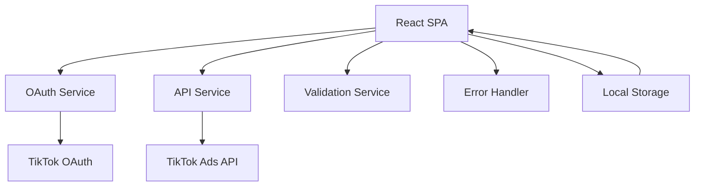
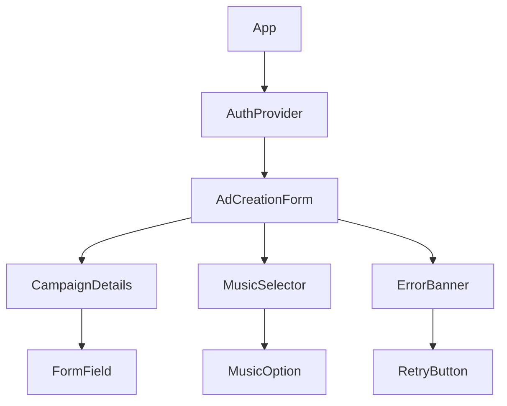

# Design Document

## Overview

The TikTok Ads Creative Flow application is a React-based single-page application that integrates with TikTok's OAuth and Ads API to provide a streamlined ad creation experience. The application emphasizes robust error handling, conditional validation, and clear user feedback over visual complexity.

## Architecture

### High-Level Architecture



### Component Structure



## Components and Interfaces

### Core Components

#### 1. AuthProvider
- **Purpose**: Manages OAuth flow and token storage
- **State**: `{ isAuthenticated: boolean, token: string | null, user: object | null }`
- **Methods**: `login()`, `logout()`, `refreshToken()`, `handleCallback()`

#### 2. AdCreationForm
- **Purpose**: Main form container with validation orchestration
- **State**: `{ formData: AdFormData, errors: ValidationErrors, isSubmitting: boolean }`
- **Methods**: `validateForm()`, `submitAd()`, `resetForm()`

#### 3. MusicSelector
- **Purpose**: Handles conditional music selection logic
- **Props**: `{ objective: string, onMusicChange: function, error: string }`
- **State**: `{ selectedOption: string, musicId: string, isValidating: boolean }`

#### 4. ErrorHandler
- **Purpose**: Centralized error processing and user-friendly message generation
- **Methods**: `processApiError()`, `getErrorMessage()`, `shouldRetry()`

### API Service Layer

#### OAuth Service
```typescript
interface OAuthService {
  initiateLogin(): void;
  handleCallback(code: string): Promise<AuthResult>;
  refreshToken(): Promise<string>;
  logout(): void;
}
```

#### TikTok Ads API Service
```typescript
interface TikTokAdsService {
  validateMusicId(musicId: string): Promise<ValidationResult>;
  createAd(adData: AdCreationData): Promise<AdCreationResult>;
  getUserProfile(): Promise<UserProfile>;
}
```

## Data Models

### Ad Form Data
```typescript
interface AdFormData {
  campaignName: string;
  objective: 'Traffic' | 'Conversions';
  adText: string;
  cta: string;
  musicOption: 'existing' | 'upload' | 'none';
  musicId?: string;
}
```

### Validation Errors
```typescript
interface ValidationErrors {
  campaignName?: string;
  adText?: string;
  cta?: string;
  music?: string;
  global?: string;
}
```

### API Response Types
```typescript
interface ApiError {
  code: string;
  message: string;
  details?: any;
}

interface AuthResult {
  success: boolean;
  token?: string;
  user?: UserProfile;
  error?: ApiError;
}
```

## Error Handling

### Error Classification System

#### 1. Authentication Errors
- **Invalid Credentials**: "Invalid app configuration. Please contact support."
- **Missing Permissions**: "Missing required advertising permissions. Please grant all requested permissions."
- **Expired Token**: "Your session has expired. Please reconnect your TikTok account."

#### 2. Validation Errors
- **Invalid Music ID**: "The selected music is not available. Please choose a different track."
- **Geo-restriction**: "TikTok Ads is not available in your region."
- **Form Validation**: Field-specific inline messages

#### 3. System Errors
- **Network Issues**: "Network error. Please check your connection and try again."
- **Service Unavailable**: "TikTok Ads service is temporarily unavailable. Please try again later."

### Error Recovery Patterns

#### Retry Logic
```typescript
interface RetryConfig {
  maxAttempts: number;
  backoffMs: number;
  retryableErrors: string[];
}
```

#### Fallback Strategies
- **OAuth Failure**: Clear stored tokens, redirect to login
- **API Failure**: Preserve form data, show retry option
- **Validation Failure**: Highlight specific fields, provide correction guidance

## Testing Strategy

### Unit Testing Focus Areas
1. **Validation Logic**: Form field validation rules and conditional logic
2. **Error Processing**: Error message generation and classification
3. **OAuth Flow**: Token handling and storage mechanisms
4. **Music Selection**: Conditional validation based on campaign objective

### Integration Testing Scenarios
1. **Complete OAuth Flow**: From login initiation to token storage
2. **Form Submission**: End-to-end ad creation with various input combinations
3. **Error Recovery**: API failure scenarios and user recovery paths
4. **Music Validation**: All three music options with success/failure cases

### Manual Testing Checklist
- [ ] OAuth connection with valid/invalid credentials
- [ ] Form validation with edge cases (empty, max length, special characters)
- [ ] Music selection logic for both Traffic and Conversions objectives
- [ ] Error message clarity and actionability
- [ ] Network failure simulation and recovery
- [ ] Mobile responsiveness and accessibility

## Implementation Considerations

### OAuth Configuration
- **Client ID/Secret**: Environment variables for security
- **Redirect URI**: Must match TikTok Developer App configuration
- **Scopes**: `ads:read`, `ads:write` for full functionality
- **PKCE**: Implement for enhanced security (recommended for SPAs)

### State Management
- **Local State**: React hooks for component-level state
- **Global State**: Context API for authentication and user data
- **Persistence**: localStorage for token storage with expiration handling

### API Integration Approach
- **Real API**: Preferred for demonstration of actual integration
- **Mock Fallback**: Documented assumptions for geo-restricted or unavailable endpoints
- **Hybrid Approach**: Real OAuth with mocked ad creation if API access is limited

### Performance Optimizations
- **Debounced Validation**: Prevent excessive API calls during typing
- **Lazy Loading**: Code splitting for OAuth callback handling
- **Error Boundaries**: Graceful handling of unexpected React errors

### Security Considerations
- **Token Storage**: Secure localStorage with expiration checks
- **CSRF Protection**: State parameter in OAuth flow
- **Input Sanitization**: Prevent XSS in user-generated content
- **Environment Variables**: Secure handling of API credentials

## Development Timeline

### Phase 1: Core Setup (Day 1)
- Project initialization with React and TypeScript
- OAuth service implementation and TikTok Developer App setup
- Basic component structure and routing

### Phase 2: Form Implementation (Day 2)
- Ad creation form with validation
- Music selection component with conditional logic
- Error handling infrastructure

### Phase 3: Integration & Polish (Day 3)
- API integration and error handling
- Testing and bug fixes
- Documentation and video preparation

This design provides a solid foundation for building a production-quality TikTok Ads creative flow while maintaining focus on the core requirements and evaluation criteria.